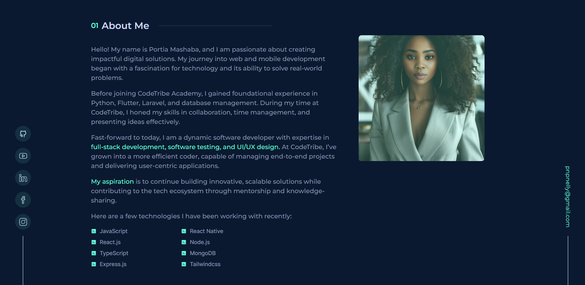
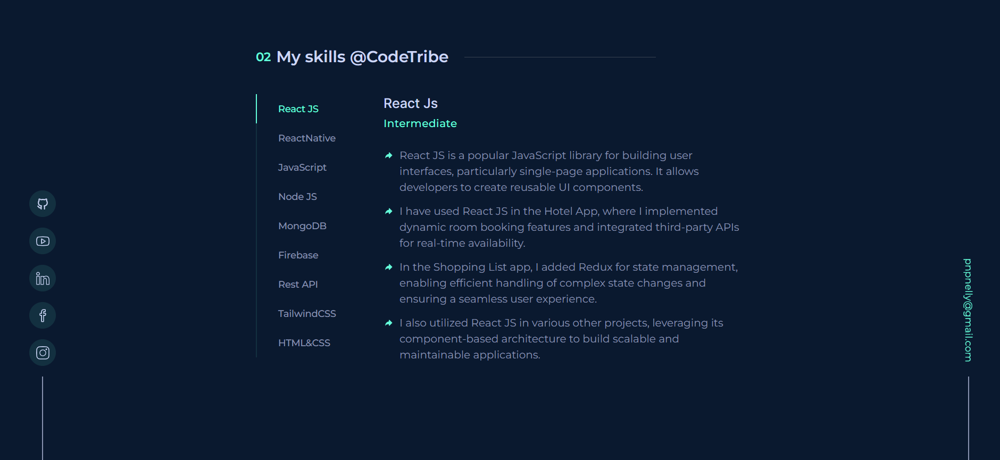
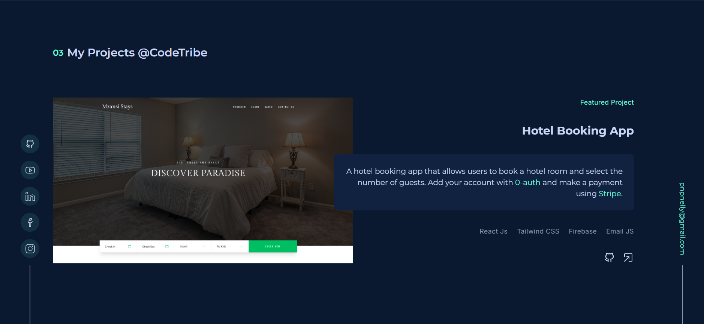

# Portfolio of Evidence

A modern, responsive portfolio website built with React showcasing skills, projects, and professional achievements. This portfolio demonstrates proficiency in modern web development technologies and design principles.

## 📸 Screenshots


*Home page with hero section and introduction*


*About section with personal information and background*


*Skills section displaying technical competencies*


*Projects section showcasing completed work and applications*

## 🚀 Features

- **Responsive Design**: Fully responsive layout that works on all device sizes
- **Modern UI/UX**: Clean and intuitive interface built with Tailwind CSS
- **Smooth Animations**: Engaging animations powered by Framer Motion
- **Interactive Navigation**: Easy-to-use navigation with React Router
- **Project Showcase**: Display of portfolio projects with detailed information
- **Skills Display**: Visual representation of technical skills and competencies
- **Archive Section**: Additional projects and accomplishments
- **Assessment & Other Info**: Sections for assessments and additional information

## 🛠️ Technologies Used

- **React 19.0.0**: Modern React with latest features
- **React Router DOM 7.1.1**: Client-side routing
- **Framer Motion 11.17.0**: Animation library for smooth transitions
- **Tailwind CSS 3.4.17**: Utility-first CSS framework
- **React Icons 5.4.0**: Icon library for React components
- **React Scripts 5.0.1**: Build tooling for Create React App

## 📦 Installation

1. Clone the repository:
```bash
git clone <repository-url>
cd portfolio-of-evidence
```

2. Install dependencies:
```bash
npm install
```

3. Start the development server:
```bash
npm start
```

4. Open [http://localhost:3000](http://localhost:3000) in your browser to view the app.

## 🏗️ Project Structure

```
portfolio-of-evidence/
├── public/              # Static assets
├── src/
│   ├── assets/          # Images and media files
│   │   ├── Home.png
│   │   ├── about.png
│   │   ├── skills.png
│   │   ├── projects.png
│   │   └── ...
│   ├── components/      # React components
│   │   ├── About.js
│   │   ├── Hero.js
│   │   ├── Skills.js
│   │   ├── Projects.js
│   │   ├── Navbar.js
│   │   ├── Footer.js
│   │   ├── LeftSide.js
│   │   ├── RightSide.js
│   │   └── skills/      # Skill-specific components
│   ├── App.js           # Main application component
│   └── index.js         # Entry point
├── package.json
├── tailwind.config.js   # Tailwind CSS configuration
└── README.md
```

## 📜 Available Scripts

### `npm start`
Runs the app in development mode at [http://localhost:3000](http://localhost:3000). The page will reload automatically when you make changes.

### `npm test`
Launches the test runner in interactive watch mode.

### `npm run build`
Builds the app for production to the `build` folder. The build is optimized and minified for best performance.

### `npm run eject`
**Note: This is a one-way operation!** Ejects from Create React App, giving you full control over configuration files.

## 🎨 Components

- **Hero**: Landing section with introduction
- **About**: Personal information and background
- **Skills**: Technical skills display with interactive cards
- **Projects**: Portfolio projects showcase
- **Archieve**: Additional projects archive
- **Assessment**: Assessment information section
- **OtherInfo**: Additional information section
- **Navbar**: Navigation bar
- **Footer**: Footer with links and information
- **LeftSide/RightSide**: Side navigation elements

## 🔧 Configuration

The project uses Tailwind CSS for styling. Configuration can be found in `tailwind.config.js`.

## 📱 Responsive Design

The portfolio is fully responsive and optimized for:
- Desktop (xl screens)
- Tablets (md, lg screens)
- Mobile devices (sm screens)

## 🚢 Deployment

To deploy this portfolio:

1. Build the production version:
```bash
npm run build
```

2. Deploy the `build` folder to your preferred hosting service (Vercel, Netlify, GitHub Pages, etc.)

## 📄 License

This project is private.

## 👤 Author

Portfolio created for showcasing professional work and skills.

---

**Note**: The screenshot images (Home.png, about.png, skills.png, projects.png) should be placed in the `src/assets/` directory. If your image filenames differ, please update the paths in this README accordingly.
